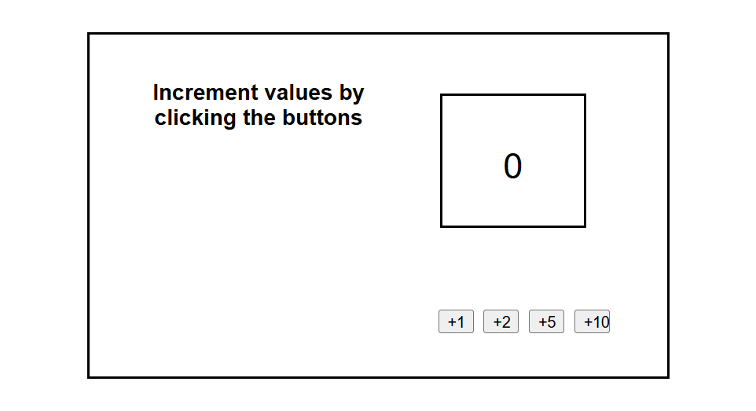

# Increment Values Web Application

A simple and interactive web application built using HTML, CSS, and JavaScript. The application allows users to increment a displayed value by different amounts through button clicks, demonstrating JavaScript event handling, DOM manipulation, and dynamic content updates.

## Key Highlights

- Interactive Counter Application
- Multiple Increment Options
- Dynamic Value Updates
- JavaScript Event Handling
- DOM Manipulation
- Lightweight and Fast Loading

## Repository

GitHub Repository:

```text
https://github.com/Teja2037/increment-counter-app
```

## Features

### Counter Management

- Display initial value of `0`
- Increment value by +1
- Increment value by +2
- Increment value by +5
- Increment value by +10
- Real-time value updates

### User Experience

- Simple and intuitive interface
- Interactive button controls
- Instant feedback without page refresh
- Lightweight design
- Fast loading performance

### Dynamic Functionality

- JavaScript event handling
- DOM manipulation
- Dynamic content updates
- User interaction handling

## Technologies Used

- HTML5
- CSS3
- JavaScript (ES6)

## Project Structure

```text
increment-counter-app/
│
├── increment.html
├── README.md
│
└── Image/
    └── screenshot.png
```

## How to Run

1. Clone the repository

```bash
git clone https://github.com/Teja2037/increment-counter-app.git
```

2. Open `increment.html` in any modern web browser.

3. Click any increment button to update the displayed value.

## Screenshots

### Application Interface



## Purpose

This project was developed to demonstrate front-end web development skills using HTML, CSS, and JavaScript by implementing an interactive counter application that showcases event handling, DOM manipulation, and dynamic user interactions.

## Learning Outcomes

- JavaScript Event Handling
- DOM Manipulation
- Dynamic Content Updates
- User Interaction Design
- HTML Page Structure
- CSS Styling and Layout Design
- Front-End Development Fundamentals

## Future Improvements

- Add Reset button functionality
- Add Decrement button functionality
- Allow custom increment values
- Store values using Local Storage
- Improve mobile responsiveness
- Add animations and enhanced UI styling
- Implement Dark Mode support
- Track increment history

## Author

**Malla Venkata Varun Teja**

B.Tech in Computer Science and Engineering

Aspiring Software Engineer actively seeking opportunities in the IT industry to apply and enhance skills in software development, web technologies, and problem-solving while contributing to innovative projects.

GitHub Profile: https://github.com/Teja2037
